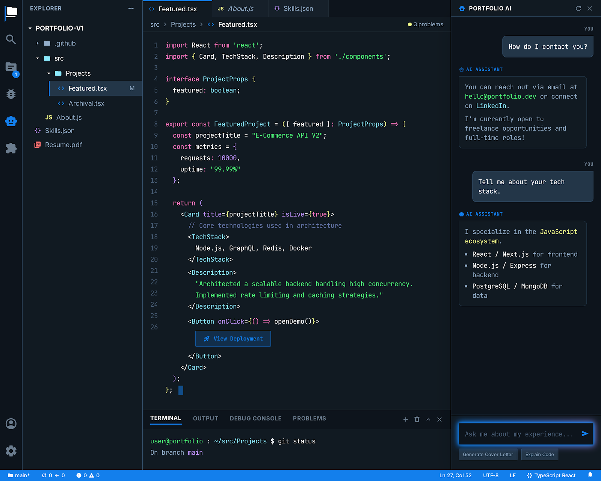

# IDE Portfolio

A web-based IDE UI portfolio website built with Astro and Tailwind CSS. Features a bootup animation sequence and a VS Code-inspired interface for showcasing projects.




## Features

### Bootup Screen
- ASCII art "IDE DEV" header with system version
- Animated terminal boot sequence with sequential line reveals
- Progress bar with grid pattern and striped animation
- CRT scanline overlay effect
- Auto-redirects to editor after 4 seconds

### IDE Interface
- **Activity Bar**: Icon sidebar with tool switching (Explorer, Search, Source Control, Debug, AI Assistant, Extensions)
- **File Explorer**: Collapsible folder tree with file icons and active file highlighting
- **Tab Bar**: Multi-tab interface with close buttons and active tab indicators
- **Code Editor**: 
  - Syntax-highlighted TypeScript/React code
  - Line numbers
  - Custom scrollbar styling
- **Terminal Panel**: Git status output with syntax colors
- **AI Assistant Panel**: Chat interface with quick action buttons
- **Status Bar**: Branch info, sync status, errors/warnings, cursor position, file encoding

## Tech Stack

- [Astro](https://astro.build/) - Static site generator
- [Tailwind CSS](https://tailwindcss.com/) - Utility-first CSS framework
- [TypeScript](https://www.typescriptlang.org/) - Type-safe JavaScript
- [Google Fonts](https://fonts.google.com/) - Inter and JetBrains Mono
- [Material Symbols](https://fonts.google.com/icons) - Icon font

## Getting Started

### Prerequisites

- Node.js 18+ 
- npm or yarn

### Installation

```bash
# Clone the repository
git clone <repository-url>
cd vscodeide

# Install dependencies
npm install

# Start development server
npm run dev
```

The site will be available at `http://localhost:4321`

### Build for Production

```bash
# Create production build
npm run build

# Preview production build
npm run preview
```

## Project Structure

```
├── src/
│   ├── components/
│   │   ├── bootup/          # Bootup screen components
│   │   │   ├── BootSequence.astro
│   │   │   ├── ProgressBar.astro
│   │   │   └── TerminalLine.astro
│   │   └── editor/          # IDE editor components
│   │       ├── ActivityBar.astro
│   │       ├── AIPanel.astro
│   │       ├── Breadcrumb.astro
│   │       ├── CodeEditor.astro
│   │       ├── CodeLine.astro
│   │       ├── Sidebar.astro
│   │       ├── StatusBar.astro
│   │       ├── TabBar.astro
│   │       └── Terminal.astro
│   ├── layouts/
│   │   └── BaseLayout.astro # Main layout with fonts & CRT effect
│   ├── pages/
│   │   ├── index.astro      # Bootup screen (redirects to /editor)
│   │   └── editor.astro     # Main IDE interface
│   └── styles/
│       └── global.css       # Global styles & custom animations
├── astro.config.mjs
├── tailwind.config.mjs      # Custom theme colors
└── package.json
```

## Customization

### Colors

Edit `tailwind.config.mjs` to customize the color scheme:

```javascript
colors: {
  primary: "#137fec",
  "background-dark": "#101922",
  "editor-bg": "#111a22",
  "sidebar-bg": "#0d141c",
  "syntax-pink": "#ff79c6",
  "syntax-green": "#50fa7b",
  "syntax-blue": "#8be9fd",
  "syntax-yellow": "#f1fa8c",
  "syntax-purple": "#bd93f9",
  "syntax-comment": "#6272a4",
}
```

### Code Content

Edit `src/components/editor/CodeEditor.astro` to change the displayed code:

```astro
<!-- Modify the tokens array to change code content -->
<CodeLine 
  lineNumber={1}
  tokens={[
    { type: 'keyword', content: 'import' },
    { type: 'type', content: 'React' },
    // ...
  ]}
/>
```

### Bootup Sequence

Edit `src/components/bootup/BootSequence.astro` to customize boot messages:

```astro
<TerminalLine 
  icon="terminal"
  text="Your custom message"
  status="ok"
/>
```

## Browser Support

- Chrome/Edge 90+
- Firefox 88+
- Safari 14+

## License

MIT License - feel free to use this template for your own portfolio!

## Credits

- Original HTML designs from [stitch](./stitch/) folder
- Converted to Astro using [superpowers](https://github.com/obra/superpowers) skills
